# VisionTrace

[English](#english)

> 面向 Windows 的低延迟屏幕视觉工具链，集成实时采集、YOLO/TensorRT 推理、透明叠加层、演示帧导出和数据集级自动标注流程。

VisionTrace 是一个本地实时视觉系统。它把高频屏幕采集、YOLO/TensorRT 推理、透明叠加层、Web 控制面板、性能日志图表和自动标注数据集工具放在同一个轻量工程里，目标是在真实桌面画面中稳定完成低延迟检测、调参、演示素材生成和数据集迭代。

## 模型效果展示

下面 9 张图来自 `media/demo1.jpg` 到 `media/demo9.jpg`，展示公开模型在实际画面中的检测效果。当前模型重点覆盖 body/head 目标识别、远近尺度变化、局部遮挡和复杂背景下的稳定输出。

<table>
  <tr>
    <td>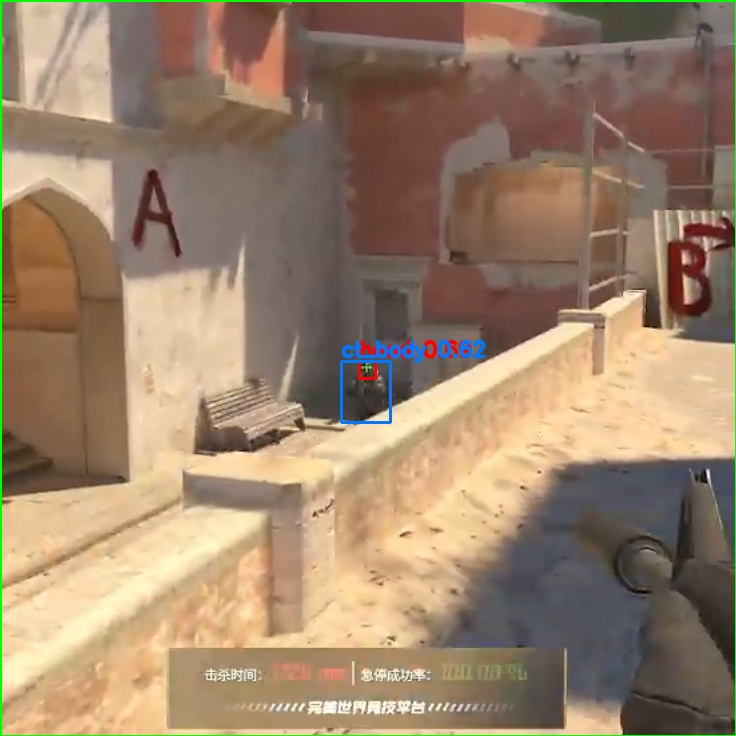</td>
    <td>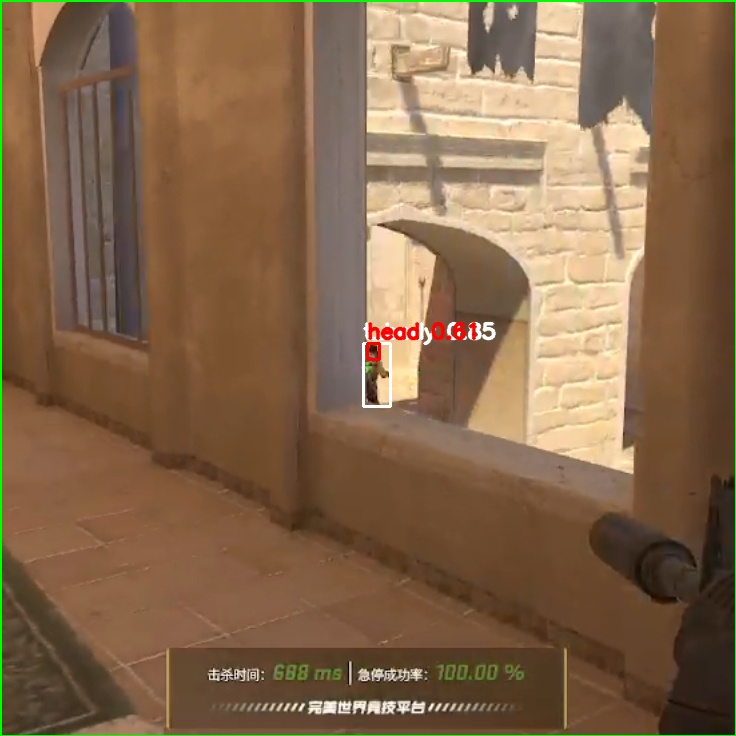</td>
    <td>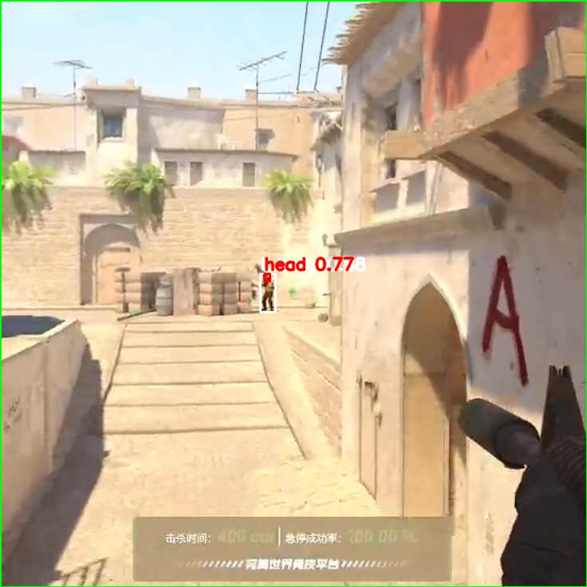</td>
  </tr>
  <tr>
    <td>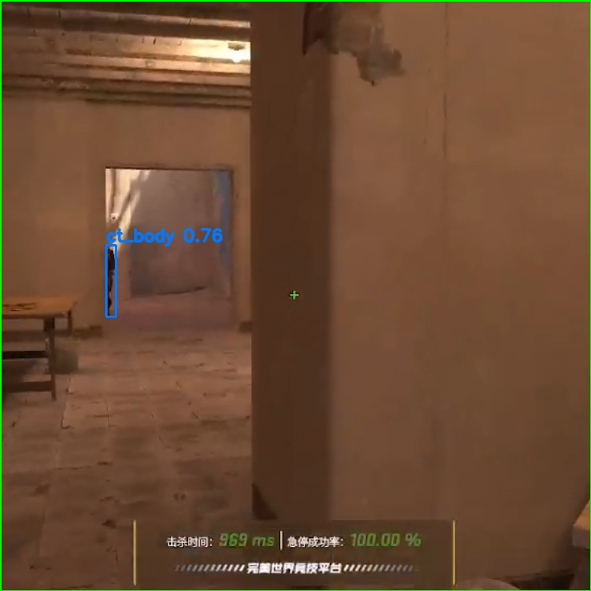</td>
    <td>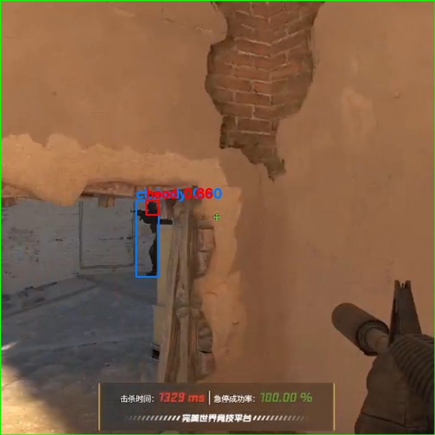</td>
    <td>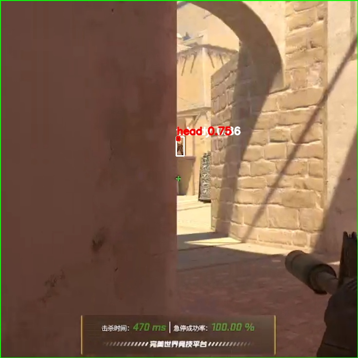</td>
  </tr>
  <tr>
    <td>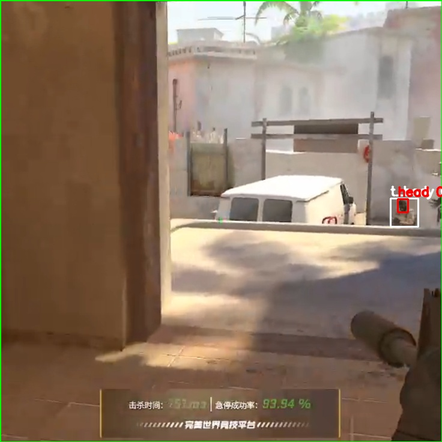</td>
    <td>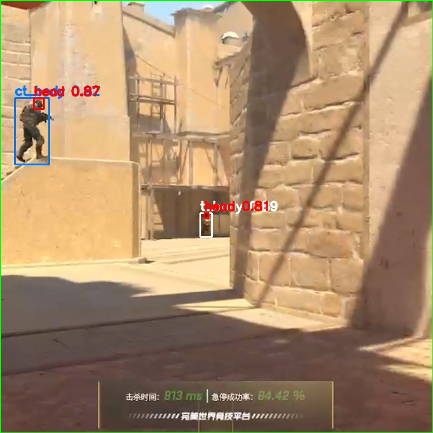</td>
    <td>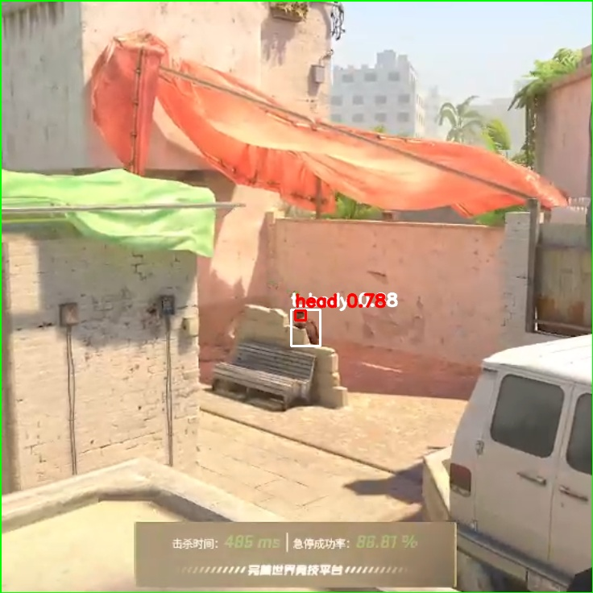</td>
  </tr>
</table>

颜色约定：

- `head`: 红色框
- `ct_body`: 蓝色框
- `t_body`: 白色框
- 其他类别: 绿色框

## 公开权重与模型性能

公开权重：

```text
yolo26l_mix_dust2_mirage_736.pt
```

下载方式：在项目 [Releases](https://github.com/Rand0MGG/VisionTrace/releases) 页面获取同名权重文件，并放入本地 `models/` 目录。

`yolo26l_mix_dust2_mirage_736.pt` 是 VisionTrace 推荐的公开权重。它基于 YOLO26L 训练，输入尺寸为 `736`，面向 Counter-Strike 实战画面中的三类目标：`ct_body`、`t_body` 和 `head`。训练数据来自 `dust2`、`mirage` 与 `mix` 数据集，重点覆盖远近尺度变化、局部遮挡、复杂背景和 body/head 组合检测。

在验证集上，该模型取得 `0.939` 的 Best mAP50、`0.690` 的 Best mAP50-95、`0.959` 的 Best Precision 和 `0.903` 的 Best Recall。最终轮指标保持在 `0.935` mAP50、`0.687` mAP50-95、`0.944` Precision 和 `0.888` Recall，适合作为实时检测、演示帧生成和自动标注起点。

验证结果摘要：

| 指标 | 数值 |
|---|---:|
| Best mAP50 | 0.939 |
| Best mAP50-95 | 0.690 |
| Best Precision | 0.959 |
| Best Recall | 0.903 |
| Final Precision | 0.944 |
| Final Recall | 0.888 |
| Final mAP50 | 0.935 |
| Final mAP50-95 | 0.687 |

训练配置摘要：

| 项目 | 配置 |
|---|---|
| Base model | YOLO26L |
| Image size | 736 |
| Epochs | 200 |
| Batch size | 8 |
| Classes | `ct_body`, `t_body`, `head` |
| Dataset mix | `mix` + `dust2` + `mirage` |

## Web 控制面板

VisionTrace 提供本地 Web 面板，用来配置、启动、停止、查看状态和分析日志。

| 配置页面 | 性能图表 | 文本日志 |
|---|---|---|
|  |  |  |

面板支持：

- 选择模型、显示器、推理设备和输入尺寸
- 切换 ROI、自动采集频率、平滑和透明叠加层
- 启动、停止和查看本地运行进程状态
- 将 `FLOW` 性能日志解析成延迟、吞吐和掉帧图表
- 保存内部合成的带框演示帧，解决录屏软件无法捕获透明叠加层的问题
- 以数据集为单位准备、标注、规范化、打乱和合并自动标注数据

## 核心能力

- 高频 Windows 屏幕采集，基于 `dxcam`
- 多进程采集、推理、渲染解耦
- 共享内存传帧，减少不必要的数据复制
- 支持 Ultralytics `.pt`、ONNX 和 TensorRT `.engine`
- 支持 YOLO26 end-to-end / NMS-free 推理路径
- 支持中心 ROI，适合低延迟聚焦场景
- 支持透明叠加层实时显示
- 支持内部合成带框演示帧
- 支持自动调节采集频率，降低积压和延迟
- 支持自动收图、批量自动标注、train/val/test 切分和数据集合并
- 支持中英文 Web UI 和持久化 JSON 配置

## 快速开始

推荐环境：

```bash
conda activate cvcap
pip install -r requirements.txt
```

启动 Web 面板：

```bash
python -m cvcap.web --port 8772 --no-open
```

然后打开：

```text
http://127.0.0.1:8772
```

命令行直接运行：

```bash
python -m cvcap
```

常用命令示例：

```bash
python -m cvcap --vis
python -m cvcap --capture-hz 120 --roi-square
python -m cvcap --auto-capture --target-drop-fps 4.0
python -m cvcap --smooth --smooth-alpha 0.6
```

保存带框演示帧：

```bash
python -m cvcap --demo-capture --demo-capture-dir debug/demo_frames --demo-capture-interval-s 1.0
```

默认只保存有检测框的帧。输出图片由程序内部把原始画面和检测框合成，适合制作 README、演示视频素材和模型效果回看。

## 模型使用建议

推荐使用公开权重开始：

```text
models/yolo26l_mix_dust2_mirage_736.pt
```

常见工作流：

1. 从 Releases 下载 `yolo26l_mix_dust2_mirage_736.pt`
2. 将权重放入 `models/`
3. 在 Web 面板中选择该 `.pt` 权重并先跑通实时检测
4. 需要更低延迟时，在本机环境中导出 TensorRT `.engine`
5. 根据实际画面调 `imgsz`、`conf`、`yolo_classes`、ROI 和采集频率

TensorRT 导出示例：

```bash
python -c "from ultralytics import YOLO; YOLO('models/yolo26l_mix_dust2_mirage_736.pt').export(format='engine', imgsz=736, half=True, device=0)"
```

## 自动标注与数据集工作流

自动标注模块以数据集根目录为操作对象。比如选择：

```text
datasets/mirage2
```

程序会围绕这个数据集根目录识别或创建：

```text
datasets/mirage2/
|-- data.yaml
|-- classes.txt
|-- staging/
|-- |-- images/
|-- train/
|-- |-- images/
|-- |-- labels/
|-- val/
|-- |-- images/
|-- |-- labels/
|-- test/
|-- |-- images/
|-- |-- labels/
```

推荐流程：

1. 在 Web 面板选择或输入数据集根目录，例如 `datasets/mirage2`
2. 开启自动收图，运行时图片先进入 `staging/images`
3. 人工筛查暂存图片，删除不需要的样本
4. 点击“准备 / 切分数据集”，按比例打乱并分配到 `train`、`val`、`test`
5. 使用当前模型批量写出 YOLO label
6. 需要时点击“规范化数据集”，统一图片和标签命名
7. 对单个 `train`、`val` 或 `test` 点击“打乱单个划分”，图片和对应标签会绑定操作并重新命名
8. 当新数据集可训练后，点击“合并数据集”，把源数据集合并进目标数据集

数据集命名规则：

```text
<dataset>_<split>_<index>.jpg
<dataset>_<split>_<index>.txt
```

例如：

```text
mirage_train_000000.jpg
mirage_train_000000.txt
mirage_val_000000.jpg
mirage_val_000000.txt
```

默认类别名：

```text
ct_body
t_body
head
```

如果源数据集和目标数据集都存在类别配置，合并时会检查类别名是否一致，避免把不兼容标签混进同一个训练集。

## 运行流程

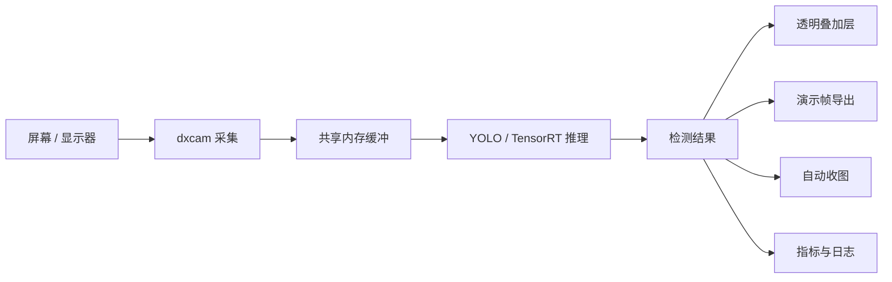

## Web 与运行时关系

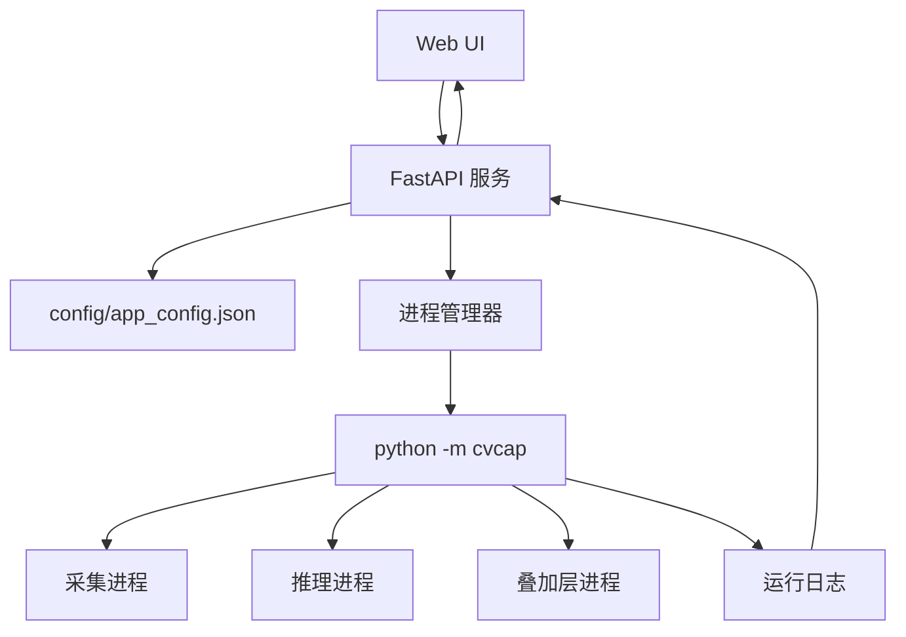

## 关键参数

| 参数 | 作用 |
|---|---|
| `model` | 使用的 `.pt`、`.onnx` 或 `.engine` 模型 |
| `device` | 推理设备，例如 `cuda:0` 或 `cpu` |
| `capture_hz` | 目标屏幕采集频率 |
| `imgsz` | 推理输入尺寸 |
| `conf` | 检测置信度阈值 |
| `iou` | NMS IoU 阈值 |
| `yolo_classes` | 类别过滤，留空表示不过滤 |
| `roi_square` | 是否启用中心 ROI |
| `roi_radius_px` | ROI 半径 |
| `visualize` | 是否显示透明叠加层 |
| `demo_capture` | 是否保存内部合成的带框演示帧 |
| `auto_capture` | 是否启用自动采集频率控制 |
| `smooth` | 是否启用检测框平滑 |
| `auto_label_dataset_root` | Web 面板中选择的数据集根目录 |
| `auto_label_min_interval_s` | 自动收图最小间隔 |

## 项目结构

```text
VisionTrace/
|-- cvcap/                         # Root shim package
|-- config/                        # Local runtime config
|-- docs/                          # Project docs
|-- media/                         # README images
|-- models/                        # Local model files used at runtime
|-- src/
|-- |-- cvcap/
|-- |-- |-- app/                   # CLI and runtime orchestration
|-- |-- |-- adapters/              # Capture and inference adapters
|-- |-- |-- core/                  # Config, detections, errors
|-- |-- |-- runtime/               # Shared buffer, overlay, saving, metrics, auto-label
|-- |-- |-- web/                   # FastAPI server and static frontend
|-- tools/                         # Local debugging tools
```

## 性能调优提示

- `Wait` 高：通常说明采集供帧或进程同步在拖慢链路
- `GPU` 高：通常说明推理是瓶颈，可以尝试 TensorRT、降低 `imgsz` 或启用 ROI
- `Ovhd` 高：通常说明 Python 调度、日志、绘制或后台负载需要检查
- ROI 适合目标主要出现在屏幕中心的场景
- 自动采集频率适合长时间运行时抑制积压
- 演示帧保存是异步写盘，建议只在需要素材时打开

## 常见问题

**为什么录屏看不到框？**

部分录屏方式不会捕获透明 overlay 窗口。开启 `Save Demo Frames` 或命令行 `--demo-capture`，程序会内部合成带框图片并保存到 `debug/demo_frames`。

**数据集按钮会直接改我正在选择的输出目录吗？**

数据集工具以用户选择的数据集根目录或划分目录为对象。准备、规范化、打乱、合并都会保持图片和对应 label 绑定处理，避免图像和标注错位。

**`test` 比例可以为 0 吗？**

可以。只需要 train/val 时保持 `test=0` 即可。

## 许可证

本仓库使用自定义非商用许可证，见 [LICENSE](LICENSE)。

简要来说：

- 可以阅读、修改、分发源码
- 默认禁止商业使用
- 商业用途需要单独授权

## 免责声明

VisionTrace 面向计算机视觉工程、本地监测、实验、演示、数据集整理和研究用途。请遵守适用法律、平台规则和使用环境的授权要求。

---

## English

> A low-latency Windows screen vision toolkit for real-time capture, YOLO/TensorRT inference, transparent overlay rendering, demo-frame export, and dataset-oriented auto-label workflows.

VisionTrace is a local real-time computer vision system for screen understanding. It combines high-frequency screen capture, YOLO/TensorRT inference, a transparent overlay, a local Web control panel, live performance charts, and dataset-level auto-label tools in one lightweight project.

## Model Gallery

The 9 images at the top of this README, `media/demo1.jpg` through `media/demo9.jpg`, show the public model on real frames. They highlight body/head detection, scale variation, partial occlusion, and stable output in visually complex scenes.

Current box colors:

- `head`: red
- `ct_body`: blue
- `t_body`: white
- Other classes: green

## Public Weights And Model Performance

Public weight:

```text
yolo26l_mix_dust2_mirage_736.pt
```

Download it from the project [Releases](https://github.com/Rand0MGG/VisionTrace/releases) page as the asset with the same filename, then place it under the local `models/` directory.

`yolo26l_mix_dust2_mirage_736.pt` is the recommended public VisionTrace weight. It is a YOLO26L detector trained at `736` input size for three Counter-Strike scene classes: `ct_body`, `t_body`, and `head`. The training data comes from the `dust2`, `mirage`, and `mix` datasets, with coverage for scale variation, partial occlusion, complex backgrounds, and paired body/head detection.

On the validation set, the model reaches `0.939` Best mAP50, `0.690` Best mAP50-95, `0.959` Best Precision, and `0.903` Best Recall. The final epoch remains strong at `0.935` mAP50, `0.687` mAP50-95, `0.944` Precision, and `0.888` Recall, making it a practical starting point for real-time detection, demo-frame generation, and auto-label workflows.

Validation summary:

| Metric | Value |
|---|---:|
| Best mAP50 | 0.939 |
| Best mAP50-95 | 0.690 |
| Best Precision | 0.959 |
| Best Recall | 0.903 |
| Final Precision | 0.944 |
| Final Recall | 0.888 |
| Final mAP50 | 0.935 |
| Final mAP50-95 | 0.687 |

Training summary:

| Item | Value |
|---|---|
| Base model | YOLO26L |
| Image size | 736 |
| Epochs | 200 |
| Batch size | 8 |
| Classes | `ct_body`, `t_body`, `head` |
| Dataset mix | `mix` + `dust2` + `mirage` |

## Web Control Panel

VisionTrace includes a local Web panel for configuration, process control, status inspection, and runtime log analysis.

The panel supports:

- Model, monitor, device, and image-size selection
- ROI, adaptive capture rate, smoothing, and transparent overlay controls
- Start, stop, and status controls for the local runtime process
- Parsed `FLOW` performance logs rendered as latency, throughput, and dropped-frame charts
- Internally rendered demo-frame saving for recorders that cannot capture transparent overlays
- Dataset-root based auto-label preparation, annotation, normalization, split shuffle, and merge tools

## Highlights

- High-frequency Windows screen capture via `dxcam`
- Multi-process capture, inference, and rendering
- Shared-memory frame transport to avoid unnecessary copies
- Ultralytics `.pt`, ONNX, and TensorRT `.engine` support
- YOLO26 end-to-end / NMS-free inference path
- Center ROI support for focused low-latency use cases
- Real-time transparent overlay visualization
- Internal annotated demo-frame export
- Adaptive capture-rate control to reduce backlog and latency
- Auto image collection, batch auto-annotation, train/val/test splitting, and dataset merging
- Bilingual Web UI and persistent JSON configuration

## Quick Start

Recommended environment:

```bash
conda activate cvcap
pip install -r requirements.txt
```

Start the Web panel:

```bash
python -m cvcap.web --port 8772 --no-open
```

Open:

```text
http://127.0.0.1:8772
```

Run directly from CLI:

```bash
python -m cvcap
```

Common examples:

```bash
python -m cvcap --vis
python -m cvcap --capture-hz 120 --roi-square
python -m cvcap --auto-capture --target-drop-fps 4.0
python -m cvcap --smooth --smooth-alpha 0.6
```

Save annotated demo frames:

```bash
python -m cvcap --demo-capture --demo-capture-dir debug/demo_frames --demo-capture-interval-s 1.0
```

By default, VisionTrace only saves frames with detections. The output images are rendered internally from the raw frame and detection boxes, making them useful for README assets, demo videos, and model-result review.

## Model Notes

Start with the public weight:

```text
models/yolo26l_mix_dust2_mirage_736.pt
```

Typical workflow:

1. Download `yolo26l_mix_dust2_mirage_736.pt` from Releases
2. Place it under `models/`
3. Select the `.pt` weight in the Web panel and verify real-time detection first
4. Export a TensorRT `.engine` locally when you want lower latency
5. Tune `imgsz`, `conf`, `yolo_classes`, ROI, and capture rate for your scene

TensorRT export example:

```bash
python -c "from ultralytics import YOLO; YOLO('models/yolo26l_mix_dust2_mirage_736.pt').export(format='engine', imgsz=736, half=True, device=0)"
```

## Auto-Label And Dataset Workflow

The auto-label module is designed around dataset roots. For example, choose:

```text
datasets/mirage2
```

VisionTrace will recognize or create the dataset layout:

```text
datasets/mirage2/
|-- data.yaml
|-- classes.txt
|-- staging/
|-- |-- images/
|-- train/
|-- |-- images/
|-- |-- labels/
|-- val/
|-- |-- images/
|-- |-- labels/
|-- test/
|-- |-- images/
|-- |-- labels/
```

Recommended workflow:

1. Select or enter a dataset root in the Web panel, such as `datasets/mirage2`
2. Enable auto image capture, which stores runtime images under `staging/images`
3. Review staged images manually and delete unwanted samples
4. Click `Prepare / Split Dataset` to shuffle and assign images to `train`, `val`, and `test`
5. Use the current model to batch-write YOLO labels
6. Click `Normalize Dataset` when you want consistent image and label names
7. Click `Shuffle Split` on a single `train`, `val`, or `test` split to shuffle images and labels together
8. After the new dataset is train-ready, merge the source dataset into the target dataset

Dataset naming rule:

```text
<dataset>_<split>_<index>.jpg
<dataset>_<split>_<index>.txt
```

Example:

```text
mirage_train_000000.jpg
mirage_train_000000.txt
mirage_val_000000.jpg
mirage_val_000000.txt
```

Default class names:

```text
ct_body
t_body
head
```

If both the source and target datasets define class names, merge checks that they match before copying labels into the target dataset.

## Runtime Flow

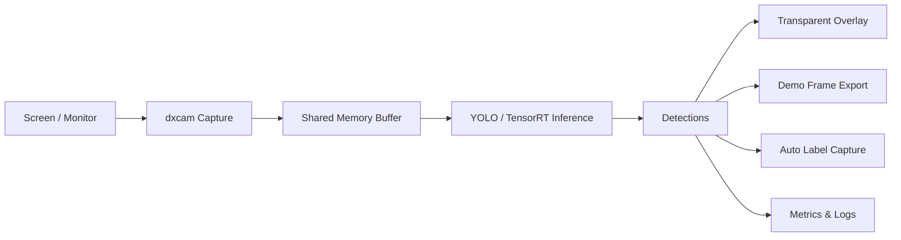

## Web And Runtime

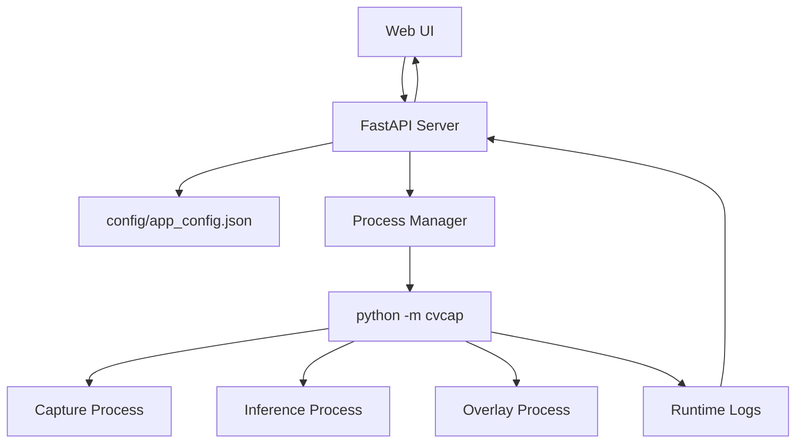

## Key Parameters

| Parameter | Purpose |
|---|---|
| `model` | `.pt`, `.onnx`, or `.engine` model file |
| `device` | Inference device such as `cuda:0` or `cpu` |
| `capture_hz` | Target screen capture rate |
| `imgsz` | Inference input size |
| `conf` | Detection confidence threshold |
| `iou` | NMS IoU threshold |
| `yolo_classes` | Optional class filter, blank means all classes |
| `roi_square` | Enable center ROI |
| `roi_radius_px` | ROI radius |
| `visualize` | Show transparent overlay |
| `demo_capture` | Save internally rendered annotated demo frames |
| `auto_capture` | Enable adaptive capture-rate control |
| `smooth` | Enable detection smoothing |
| `auto_label_dataset_root` | Dataset root selected in the Web panel |
| `auto_label_min_interval_s` | Minimum interval between auto-captured samples |

## Performance Notes

- High `Wait` often means capture supply or process synchronization is slowing the pipeline
- High `GPU` often means inference is the bottleneck
- High `Ovhd` usually points to Python scheduling, logging, drawing, or background load
- ROI works best when targets mostly appear near the center of the screen
- Adaptive capture rate helps suppress backlog during long runs
- Demo-frame saving is asynchronous, so enable it when you need output assets

## FAQ

**Why are boxes missing from my screen recording?**

Some recorders do not capture transparent overlay windows. Enable `Save Demo Frames` or pass `--demo-capture`; VisionTrace will render annotated images internally and save them under `debug/demo_frames`.

**Do dataset tools keep images and labels synchronized?**

Yes. Prepare, normalize, split shuffle, and merge operations are designed to move or rename images together with their matching YOLO label files.

**Can the `test` ratio be 0?**

Yes. Keep `test=0` if you only need train/val splits.

## License

This repository uses a custom noncommercial license. See [LICENSE](LICENSE).

In short:

- source code is visible and shareable
- modification is allowed
- commercial use is prohibited unless separately authorized

## Disclaimer

VisionTrace is intended for computer vision engineering, local monitoring, experimentation, demos, dataset work, and research. Follow applicable laws, platform rules, and authorization requirements in your environment.
