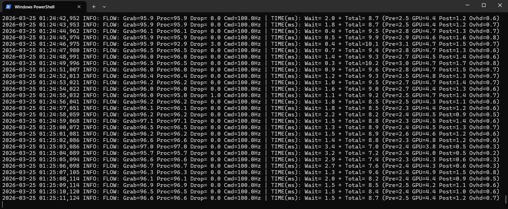
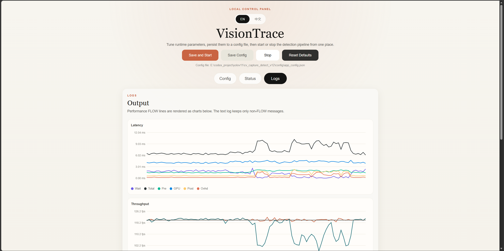
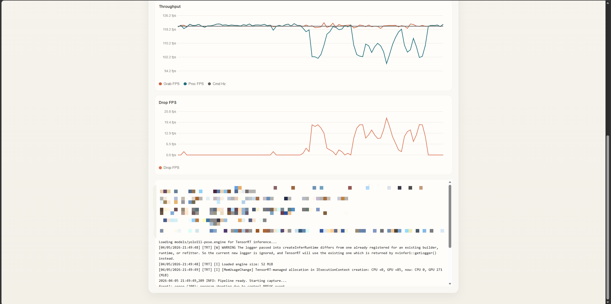
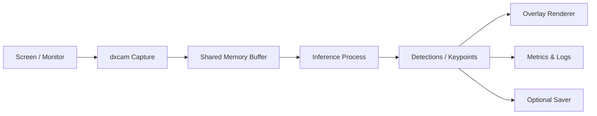
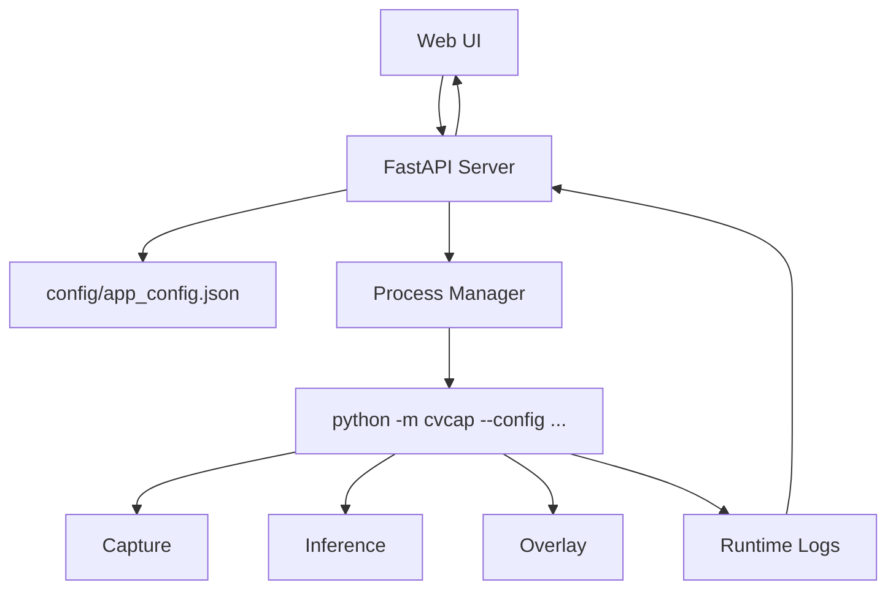
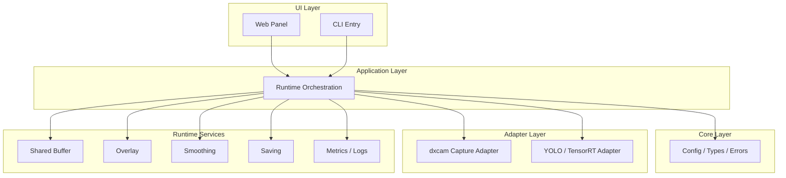
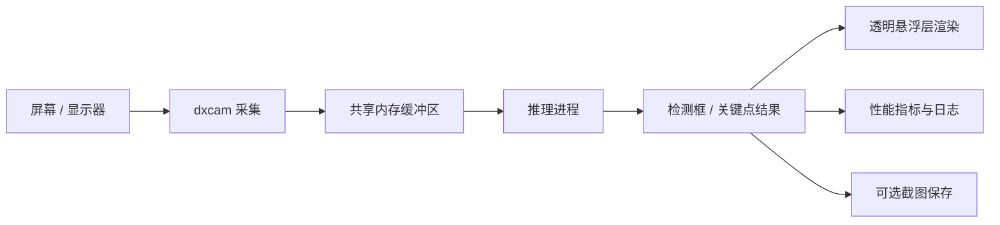
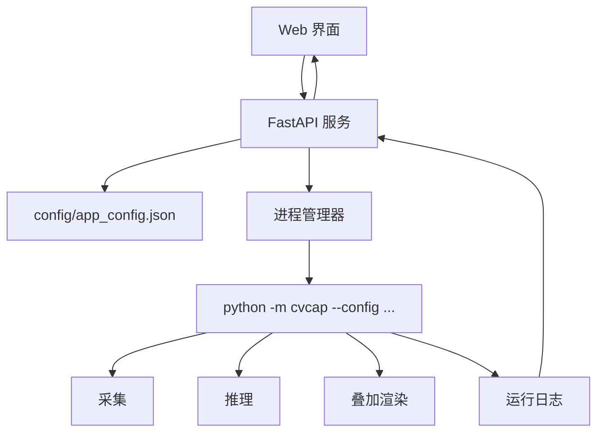
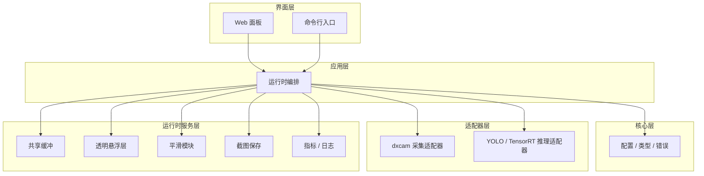

# VisionTrace

[中文](#中文说明)

> A low-latency Windows screen vision toolkit for high-frequency capture, YOLO/TensorRT inference, transparent overlay rendering, and a configurable local control panel.

## Overview

VisionTrace is a local real-time computer vision system built around screen understanding. It separates capture, inference, visualization, logging, and configuration management into clear modules so the full pipeline stays easier to run, tune, and extend.

Current highlights:

- Unified runtime entry: `python -m cvcap`
- Web control panel for config editing, start/stop, status, and logs
- Default model: `models/yolo26l-pose.engine`
- YOLO26 uses the default end-to-end / NMS-free prediction path
- Default class filter: person only (`class 0`)
- ROI cropping, adaptive capture, smoothing, transparent overlay, and async saving
- Parsed performance logs rendered as live charts in the frontend

## Demos

### ROI Enabled

With ROI enabled, the system processes only the center region of the screen, which usually reduces unnecessary computation and improves responsiveness in the main target area.


### ROI Disabled

With ROI disabled, the system processes a larger screen area and preserves more visual context.


### Config Panel

The frontend supports persistent configuration, language switching, command preview, and one-click start/stop.



### Logs Panel: Charts

The upper half of the logs page turns runtime `FLOW` lines into live charts so throughput, latency, and dropped-frame behavior can be inspected visually instead of reading raw logs.



### Logs Panel: Text Output

Non-performance logs are kept in a scrollable text output area below the charts, so long sessions do not stretch the whole page.



## Features

- High-frequency Windows screen capture powered by `dxcam`
- Multi-process separation for capture, inference, and rendering
- Shared-memory frame transport
- Ultralytics and TensorRT inference support
- Default person-only detection flow
- Transparent overlay visualization
- Optional ROI cropping
- Optional adaptive capture-rate control
- Optional smoothing
- Web UI for config, runtime status, and logs
- Persistent JSON config storage

## Pipeline Flow



## Frontend / Backend Flow



## Architecture



## Project Structure

```text
cv_capture_detect_v12/
|-- cvcap/                        # Root shim package so `python -m cvcap` works from project root
|-- config/
|-- |-- app_config.json           # Persistent runtime config
|-- media/                        # README assets
|-- models/                       # .pt / .onnx / .engine model files
|-- src/
|-- |-- cvcap/
|-- |-- |-- app/
|-- |-- |-- |-- cli.py            # CLI argument parsing and entrypoint
|-- |-- |-- |-- runtime.py        # Main runtime orchestration
|-- |-- |-- core/
|-- |-- |-- |-- config.py         # RunnerArgs
|-- |-- |-- |-- config_store.py   # Config load/save
|-- |-- |-- |-- detections.py     # Detection data types
|-- |-- |-- |-- errors.py         # Runtime error definitions
|-- |-- |-- adapters/
|-- |-- |-- |-- capture/
|-- |-- |-- |-- |-- dxcam_capture.py
|-- |-- |-- |-- inference/
|-- |-- |-- |-- |-- ultralytics_detector.py
|-- |-- |-- runtime/
|-- |-- |-- |-- shared_buffer.py
|-- |-- |-- |-- overlay.py
|-- |-- |-- |-- drawing.py
|-- |-- |-- |-- smoothing.py
|-- |-- |-- |-- metrics.py
|-- |-- |-- |-- saving.py
|-- |-- |-- |-- logging_jsonl.py
|-- |-- |-- web/
|-- |-- |-- |-- server.py
|-- |-- |-- |-- process_manager.py
|-- |-- |-- |-- forms.py
|-- |-- |-- |-- static/
|-- |-- |-- |-- |-- index.html
|-- |-- |-- |-- |-- styles.css
|-- |-- |-- |-- |-- app.js
|-- |-- |-- __main__.py
|-- tools/
|-- |-- test_capture_frame.py
```

## Environment

Recommended environment:

```bash
conda activate cvcap
```

Suggested setup:

- Windows desktop environment
- Python 3.10
- Working `dxcam`
- Installed PyTorch / Ultralytics / PyQt5 / FastAPI dependencies
- Valid local model files
- Matching TensorRT runtime if `.engine` models are used

## Quick Start

### 1. Install dependencies

Use the cleaned runtime dependency list:

```bash
pip install -r requirements.txt
```

### 2. Get a YOLO pose model

For beginners, the easiest path is to start from the official Ultralytics pose models and then export them.

Official references:

- [Ultralytics pose task docs](https://docs.ultralytics.com/tasks/pose/)
- [Ultralytics YOLO26 docs](https://docs.ultralytics.com/models/yolo26/)
- [Ultralytics export docs](https://docs.ultralytics.com/modes/export/)
- [Ultralytics assets releases](https://github.com/ultralytics/assets/releases)

According to the official docs, Ultralytics pose models download automatically from the latest official assets release on first use. In practice, you can do either of these:

```bash
# Option A: let Ultralytics download automatically on first use
python -c "from ultralytics import YOLO; YOLO('yolo26l-pose.pt')"

# Option B: download the .pt file manually from the official assets release page
# and place it under models/
```

Recommended starting point for this project:

```text
models/yolo26l-pose.pt
```

### 3. Export `.pt` to TensorRT `.engine`

If you want lower latency on a compatible NVIDIA setup, export the pose model to TensorRT.

Official Ultralytics export examples show the same export flow for ONNX and TensorRT-style formats. For this project, a typical export command is:

```bash
python -c "from ultralytics import YOLO; YOLO('models/yolo26l-pose.pt').export(format='engine', imgsz=736, half=True, device=0)"
```

After export, place or keep the generated file here:

```text
models/yolo26l-pose.engine
```

Notes:

- Export requires a working NVIDIA CUDA + TensorRT environment
- Exported engines are often hardware and software version sensitive
- If you switch GPU, CUDA, TensorRT, or major driver stack, you may need to export again

### 4. Run the pipeline from CLI

```bash
python -m cvcap
```

Common examples:

```bash
python -m cvcap --vis
python -m cvcap --capture-hz 120 --roi-square
python -m cvcap --auto-capture --target-drop-fps 4.0
python -m cvcap --smooth --smooth-alpha 0.6
```

### 5. Run the Web panel

```bash
python -m cvcap.web --port 8772 --no-open
```

Then open:

```text
http://127.0.0.1:8772
```

You can use the web panel to:

- Edit runtime parameters
- Save them to `config/app_config.json`
- Start and stop the pipeline
- Check runtime status
- Inspect parsed logs and charts
- Switch between Chinese and English UI

## Log Parsing and Visualization

VisionTrace does not simply dump raw runtime output into the browser.

The frontend parses `FLOW` lines like this:

```text
FLOW: Grab=120.8 Proc=118.8 Drop=2.0 Cmd=120.0Hz | TIME(ms): Wait=1.1 + Total=7.1 (Pre=1.6 GPU=4.6 Post=0.6 Ovhd=0.3)
```

These values are extracted and turned into live charts:

- `Latency`: `Wait`, `Total`, `Pre`, `GPU`, `Post`, `Ovhd`
- `Throughput`: `Grab FPS`, `Proc FPS`, `Cmd Hz`
- `Drop FPS`: dropped-frame behavior on its own scale

Design choices in the current UI:

- Performance lines are removed from the plain text log area after parsing
- The text output keeps only non-`FLOW` logs
- The log text area is scrollable and height-limited, so long sessions do not stretch the whole page
- The charts use a dynamic Y-axis based on recent samples, but never go below `0`
- The X-axis keeps a fixed recent sample window for stable visual comparison

## Defaults

- Default model: `models/yolo26l-pose.engine`
- Default prediction path: YOLO26 end-to-end / NMS-free
- Default class filter: `0` for person only
- Runtime parameters are persisted in `config/app_config.json`

## Key Parameters

| Parameter | Purpose |
|---|---|
| `capture_hz` | Target screen capture rate |
| `model` | Model file used for inference |
| `device` | Inference device such as `cuda:0` |
| `visualize` | Enable transparent overlay |
| `max_run_seconds` | Maximum runtime, `0` means keep running |
| `conf` | Confidence threshold |
| `iou` | NMS IoU threshold |
| `imgsz` | Inference image size |
| `yolo_classes` | Class filter, default `0` means person only |
| `roi_square` | Enable centered ROI |
| `roi_radius_px` | ROI radius |
| `auto_capture` | Enable adaptive capture control |
| `smooth` | Enable smoothing |

## Recommended First Run Path

For someone who just landed on this repository, the smoothest first-run flow is:

1. Create or activate a Windows Python environment
2. Install dependencies from `requirements.txt`
3. Download or auto-fetch `yolo26l-pose.pt` from official Ultralytics sources
4. Export it to `models/yolo26l-pose.engine` if TensorRT is available
5. Start the web panel with `python -m cvcap.web --port 8772 --no-open`
6. Open the browser, check config, and run with visualization enabled
7. If needed, fall back to `.pt` first, then optimize to `.engine` after everything works

## ROI Guidance

Use ROI when:

- You mainly care about the center region of the screen
- You want lower inference cost
- You want better responsiveness in a focused area

Disable ROI when:

- You need full-screen context
- Targets may appear near the edges
- Coverage matters more than raw latency

## Performance Notes

- High `Wait` usually means capture is the bottleneck
- High `GPU` usually means inference is the bottleneck
- High `Ovhd` usually means Python scheduling or background load is too high
- ROI often improves frame stability and end-to-end responsiveness
- Keeping `yolo_classes=0` reduces unrelated detections in person-only scenarios

## Known Notes

- If `dxcam` access fails, the current Windows session may be blocking Desktop Duplication
- If a `.engine` file fails to load, verify TensorRT compatibility
- If a `.pt` file is corrupted, Ultralytics will fail during model load
- If `max_run_seconds > 0`, the program will stop automatically by design

## Use Cases

- Real-time local vision experiments
- Human target sensing on screen output
- Pose estimation validation
- Low-latency capture / inference pipeline research
- Interactive runtime tuning and performance analysis

## Output Locations

- `config/`: persistent config files
- `debug/`: runtime debug logs
- `models/`: model files
- `media/`: README assets

## License

This repository uses a custom noncommercial license. See [LICENSE](LICENSE).

That means:

- source code is visible and shareable
- modification is allowed
- commercial use is prohibited unless separately authorized

## Disclaimer

This repository is intended for computer vision engineering, local monitoring, experimentation, demos, and research. Do not use it for cheating, malware, or abusive behavior.

---

## 中文说明

[English](#visiontrace)

> 面向 Windows 的低延迟屏幕视觉检测与姿态分析工具，集成高频采集、YOLO/TensorRT 推理、透明悬浮层显示，以及可视化本地控制面板。

## 项目简介

VisionTrace 是一个围绕“屏幕画面实时感知”设计的本地视觉系统。它将采集、推理、可视化、日志与配置管理拆分为清晰的模块，目标是在尽量低延迟的前提下，稳定地完成人物检测与姿态推理。

当前版本的重点能力：

- 统一入口为 `python -m cvcap`
- 新增 Web 控制面板，支持保存配置、启动、停止、查看状态与日志
- 默认模型为 `models/yolo26l-pose.engine`
- 默认使用 YOLO26 end-to-end / NMS-free 推理路径
- 默认类别过滤固定为人物 `class 0`
- 支持 ROI 裁剪、自动调速、平滑、透明悬浮层、异步保存
- 前端可把性能日志解析成实时折线图

## 效果展示

### 开启 ROI

开启中心 ROI 后，只处理屏幕中央区域，通常可以减少不必要的计算开销，并提升目标区域的响应速度。


### 关闭 ROI

关闭 ROI 后，将对更大范围的屏幕区域进行处理，更适合需要保留完整上下文的场景。


### 配置页面

前端支持参数持久化、语言切换、命令预览与一键启动。


### 日志页面：图表部分

日志页的上半部分会把 `FLOW` 性能日志解析成动态图表，方便快速看清时延、吞吐和掉帧变化。


### 日志页面：文本部分

日志页的下半部分保留非性能类文本日志，并限制高度、支持滚动，避免长时间运行把页面撑得过长。


## 核心特性

- `dxcam` 驱动的高频 Windows 屏幕采集
- 多进程采集 / 推理 / 渲染解耦
- 共享内存低开销传帧
- 支持 Ultralytics 与 TensorRT 推理
- 默认只识别人，适合人体目标与姿态分析
- 支持透明悬浮层可视化
- 支持可选 ROI 裁剪
- 支持可选自动抓屏频率调节
- 支持可选平滑处理
- 支持 Web UI 配置、状态与日志面板
- 支持 JSON 配置持久化

## 系统流程



## 前后端交互流程



## 架构分层说明



## 项目结构

```text
cv_capture_detect_v12/
|-- cvcap/                        # 根包 shim，确保可直接在项目根目录运行 `python -m cvcap`
|-- config/
|-- |-- app_config.json           # 持久化运行配置
|-- media/                        # README 展示素材
|-- models/                       # .pt / .onnx / .engine 模型文件
|-- src/
|-- |-- cvcap/
|-- |-- |-- app/
|-- |-- |-- |-- cli.py            # 命令行参数与启动入口
|-- |-- |-- |-- runtime.py        # 主流程编排
|-- |-- |-- core/
|-- |-- |-- |-- config.py         # RunnerArgs
|-- |-- |-- |-- config_store.py   # 配置读写
|-- |-- |-- |-- detections.py     # 检测结果数据结构
|-- |-- |-- |-- errors.py         # 运行时错误类型
|-- |-- |-- adapters/
|-- |-- |-- |-- capture/
|-- |-- |-- |-- |-- dxcam_capture.py
|-- |-- |-- |-- inference/
|-- |-- |-- |-- |-- ultralytics_detector.py
|-- |-- |-- runtime/
|-- |-- |-- |-- shared_buffer.py
|-- |-- |-- |-- overlay.py
|-- |-- |-- |-- drawing.py
|-- |-- |-- |-- smoothing.py
|-- |-- |-- |-- metrics.py
|-- |-- |-- |-- saving.py
|-- |-- |-- |-- logging_jsonl.py
|-- |-- |-- web/
|-- |-- |-- |-- server.py
|-- |-- |-- |-- process_manager.py
|-- |-- |-- |-- forms.py
|-- |-- |-- |-- static/
|-- |-- |-- |-- |-- index.html
|-- |-- |-- |-- |-- styles.css
|-- |-- |-- |-- |-- app.js
|-- |-- |-- __main__.py
|-- tools/
|-- |-- test_capture_frame.py
```

## 环境要求

推荐环境：

```bash
conda activate cvcap
```

建议满足以下条件：

- Windows 桌面环境
- Python 3.10
- 可正常使用 `dxcam`
- 已安装 PyTorch / Ultralytics / PyQt5 / FastAPI 等依赖
- 本地存在可用模型文件
- 如使用 `.engine`，需有匹配的 TensorRT 环境

## 快速开始

### 1. 安装依赖

优先使用项目当前整理过的核心依赖：

```bash
pip install -r requirements.txt
```

### 2. 获取 YOLO pose 模型

对第一次接触这个项目的人来说，最容易上手的方式是先使用 Ultralytics 官方 pose 模型，再导出为 `.engine`。

官方参考资料：

- [Ultralytics Pose 文档](https://docs.ultralytics.com/tasks/pose/)
- [Ultralytics YOLO26 文档](https://docs.ultralytics.com/models/yolo26/)
- [Ultralytics Export 文档](https://docs.ultralytics.com/modes/export/)
- [Ultralytics 官方 assets releases](https://github.com/ultralytics/assets/releases)

根据官方文档，Ultralytics 的 pose 模型在首次使用时可以自动从官方 assets release 下载。因此你可以这样做：

```bash
# 方式 A：首次调用时自动下载
python -c "from ultralytics import YOLO; YOLO('yolo26l-pose.pt')"

# 方式 B：从官方 assets release 页面手动下载 .pt
# 然后放到 models/ 目录下
```

推荐在本项目中使用这个命名：

```text
models/yolo26l-pose.pt
```

### 3. 将 `.pt` 导出为 TensorRT `.engine`

如果你的目标是降低推理延迟，并且本机 NVIDIA / CUDA / TensorRT 环境已经配置好，可以把 `.pt` 导出成 `.engine`。

一个适合本项目的典型导出方式如下：

```bash
python -c "from ultralytics import YOLO; YOLO('models/yolo26l-pose.pt').export(format='engine', imgsz=736, half=True, device=0)"
```

导出成功后，把结果放在：

```text
models/yolo26l-pose.engine
```

注意：

- 导出 `.engine` 需要可用的 NVIDIA CUDA + TensorRT 环境
- `.engine` 文件通常和导出时的 GPU、CUDA、TensorRT 版本相关
- 更换显卡、CUDA、TensorRT 或驱动后，往往需要重新导出

### 4. 命令行运行

```bash
python -m cvcap
```

常见示例：

```bash
python -m cvcap --vis
python -m cvcap --capture-hz 120 --roi-square
python -m cvcap --auto-capture --target-drop-fps 4.0
python -m cvcap --smooth --smooth-alpha 0.6
```

### 5. Web 面板运行

```bash
python -m cvcap.web --port 8772 --no-open
```

然后在浏览器中打开：

```text
http://127.0.0.1:8772
```

你可以在面板中完成这些操作：

- 修改运行参数
- 保存到 `config/app_config.json`
- 一键启动与停止
- 查看当前运行状态
- 查看解析后的日志与性能图表
- 切换中英文界面

## 日志解析与可视化

VisionTrace 不是简单地把运行日志原样塞进前端页面。

前端会解析这类性能日志：

```text
FLOW: Grab=120.8 Proc=118.8 Drop=2.0 Cmd=120.0Hz | TIME(ms): Wait=1.1 + Total=7.1 (Pre=1.6 GPU=4.6 Post=0.6 Ovhd=0.3)
```

然后自动提取指标，转成动态图表：

- `Latency`：展示 `Wait`、`Total`、`Pre`、`GPU`、`Post`、`Ovhd`
- `Throughput`：展示 `Grab FPS`、`Proc FPS`、`Cmd Hz`
- `Drop FPS`：单独展示掉帧趋势，避免和其他 FPS 混在一张图里

当前前端的设计重点：

- `FLOW` 性能日志解析后不再重复堆积到纯文本区域
- 文本日志区只保留非 `FLOW` 日志
- 文本日志区有固定高度和滚动条，长时间运行不会把整页撑爆
- 图表使用动态纵坐标，会根据最近一段时间的波动自动调整比例尺
- 纵坐标不会低于 `0`
- 横坐标保持固定样本窗口，方便连续比较趋势

## 默认配置

- 默认模型：`models/yolo26l-pose.engine`
- 默认推理路径：YOLO26 end-to-end / NMS-free
- 默认类别过滤：`0`，即只识别人
- 运行参数会持久化到 `config/app_config.json`

## 关键参数说明

| 参数 | 作用 |
|---|---|
| `capture_hz` | 目标抓屏频率 |
| `model` | 使用的模型文件 |
| `device` | 推理设备，如 `cuda:0` |
| `visualize` | 是否显示透明悬浮层 |
| `max_run_seconds` | 最大运行时长，`0` 表示持续运行 |
| `conf` | 检测置信度阈值 |
| `iou` | NMS 的 IoU 阈值 |
| `imgsz` | 推理输入尺寸 |
| `yolo_classes` | 类别过滤，默认 `0` 为人物 |
| `roi_square` | 是否启用中心 ROI |
| `roi_radius_px` | ROI 半径 |
| `auto_capture` | 是否启用自动调速 |
| `smooth` | 是否启用平滑 |

## 推荐的第一次运行流程

如果一个人第一次在 GitHub 上看到这个项目，最建议他按下面这个顺序走：

1. 准备 Windows + Python 3.10 环境
2. 安装 `requirements.txt` 中的依赖
3. 从官方 Ultralytics 来源获取 `yolo26l-pose.pt`
4. 如果本机具备 TensorRT 环境，再导出成 `models/yolo26l-pose.engine`
5. 启动 Web 面板 `python -m cvcap.web --port 8772 --no-open`
6. 在浏览器里检查配置并先跑通可视化
7. 先用 `.pt` 跑通，再切换 `.engine` 做低延迟优化

## ROI 使用建议

适合开启 ROI 的场景：

- 主要关注屏幕中心区域
- 希望尽量降低推理负担
- 需要更高的局部响应速度

适合关闭 ROI 的场景：

- 需要完整画面上下文
- 目标可能出现在屏幕边缘
- 更关注覆盖范围而不是极限低延迟

## 性能调优建议

- `Wait` 时间高：通常说明采集供帧跟不上
- `GPU` 时间高：通常说明推理是瓶颈
- `Ovhd` 时间高：通常说明 Python 调度或系统后台负载偏高
- ROI 开启后通常更容易获得稳定的高帧率
- 如果只是人物场景，保持 `yolo_classes=0` 能减少无关框

## 已知注意事项

- 若 `dxcam` 报权限或访问失败，通常是当前 Windows 会话不允许 Desktop Duplication
- 若 `.engine` 无法加载，请检查 TensorRT 版本与导出环境是否匹配
- 若某个 `.pt` 权重损坏，Ultralytics 会在模型加载阶段直接报错
- 若设置了 `max_run_seconds > 0`，程序会按配置自动停止，这不是崩溃

## 适用场景

- 本地实时视觉检测实验
- 屏幕人体目标感知
- 姿态推理验证
- 低延迟采集 / 推理管线研究
- 交互式参数调优与性能分析

## 输出目录

- `config/`：持久化配置
- `debug/`：调试日志
- `models/`：模型文件
- `media/`：README 展示素材

## 许可证

本仓库使用自定义非商用许可证，见 [LICENSE](LICENSE)。

这意味着：

- 可以阅读、修改、分发源码
- 默认禁止商业使用
- 若需商业用途，应单独获得授权

## 免责声明

本项目定位为计算机视觉基础设施与实时处理实验项目，适用于研究、监测、演示与工程验证。请勿将其用于作弊、恶意软件或其他违反软件规则与法律法规的用途。
